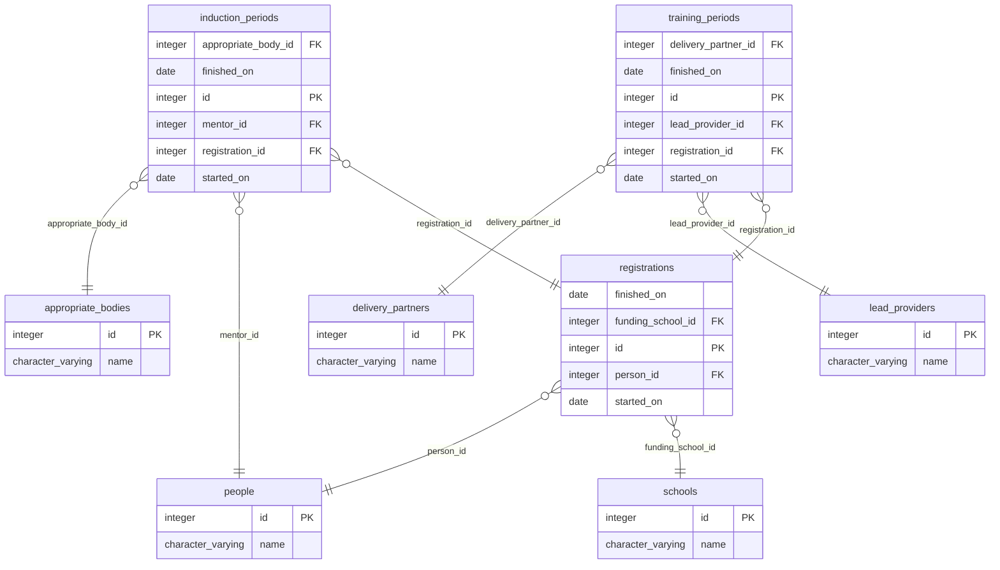
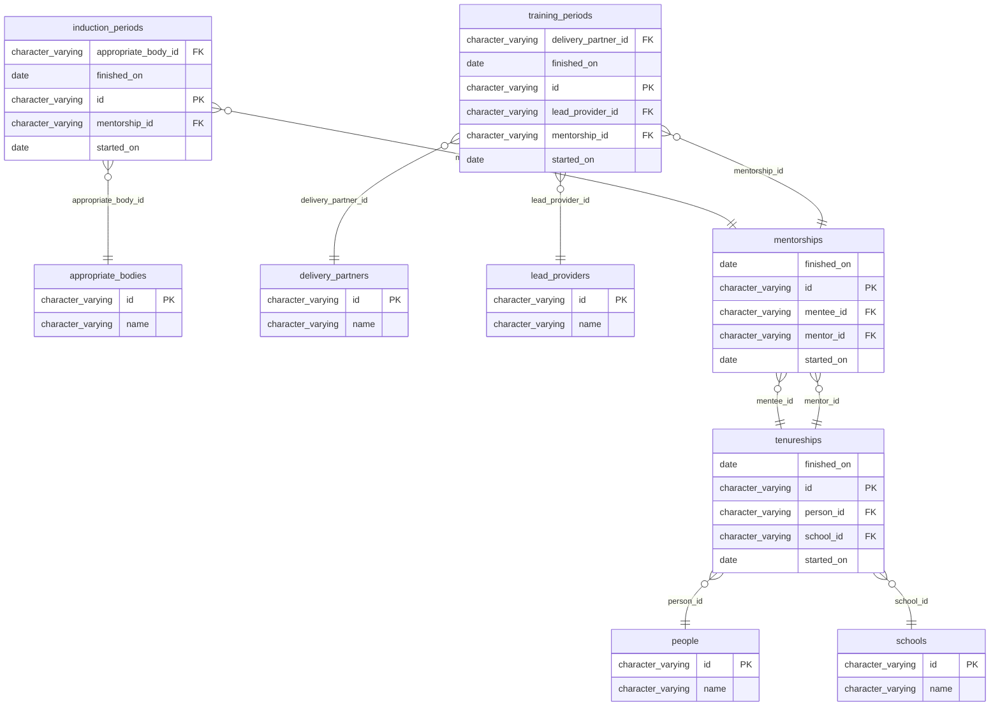
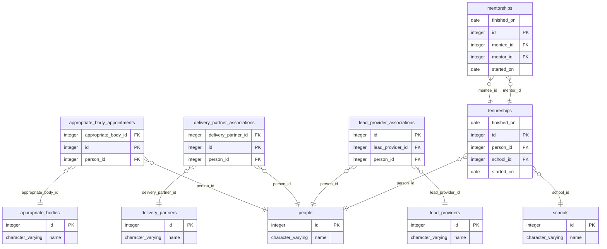

# CPD data prototypes

This is a set of data model prototypes that we intend to test out. They will be used to inform the next steps for the CPD programme's data schema, whether that is a rewrite or heavy refactor.

We're not going to worry about actually building apps, APIs or real data. The aim is to test the model and we can do that with SQL. If the queries needed to serve our API endpoints are straightforward, as in they can be written using where clauses and joins, we can be confident they will translate to [ActiveRecord](https://guides.rubyonrails.org/active_record_basics.html) nicely. If we need to use common table expressions, window queries or other advanced techniques are needed, we'd probably end up having to hardcode SQL which is one of the things we're trying to move away from.

## How it works

Each prototype will:

* be stored in its own directory; currently there are three: [Flat](#flat), [Separate](#separate) and [Hierarchical](#hierarchical).
* be responsible for creating and replacing its own database with the naming structure `prototype_{variant}`
* be able to be created and refreshed using `make`
* import its own version of the data outlined in [the data section](#data)

What we need to work out:

* we need to come up with a format for the writing scenarios in a way we can
  test and compare them
* how do we summarise the results of multiple prototypes in an easily digestible way?

## Setup

You will need:

* PostgreSQL running locally with an admin account
* [GNU make](https://www.gnu.org/software/make/)
* [Mermerd](https://github.com/KarnerTh/mermerd) to generate the [Mermaid](https://mermaid.js.org/) ERD diagrams

## Data

The same data will be expressed in each of the prototypes so queries can be directly compared.

### Appropriate Bodies

* Northern Teaching School Hub
* Southern Induction Panel

### Delivery Partners

* Excellence Trust
* Greatest Education Institute
* Ultimate Academy Group

### Lead Providers

* AI
* BPN
* TF

### Schools

* Springfield Elementary
* Grange Hill
* Hogwarts

### People

#### ECTs

* Ebony
  - has been at at **Springfield Elementary** since **2021-07-09**
* Edward
  - has been at at **Grange Hill** since **2022-06-04**
  - has been mentored by **Michael** since **2022-09-12**
* Elsa
* Erica

#### Mentors

* Mary
* Michael
  - was at **Springfield Elementary** from **2012-11-24** until **2022-04-08**
  - has been at at **Grange Hill** since **2022-05-20**
  - has been mentoring **Edward** since **2022-09-12**

## Prototypes

### Flat

### Hierarchical

### Separate

